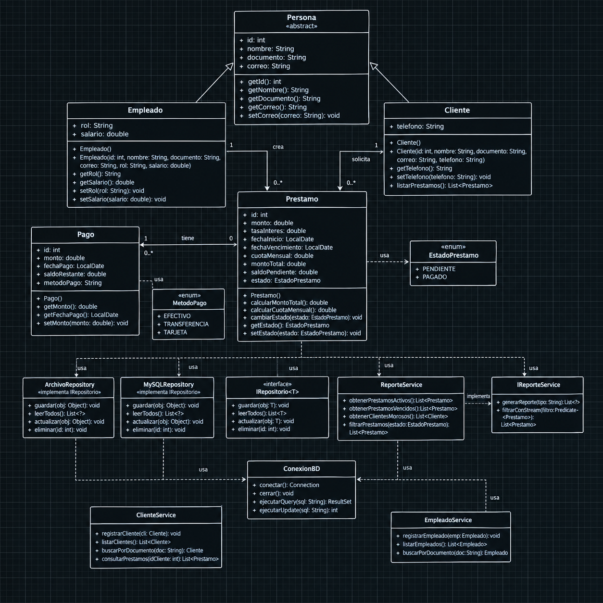
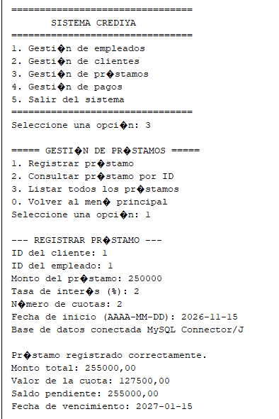
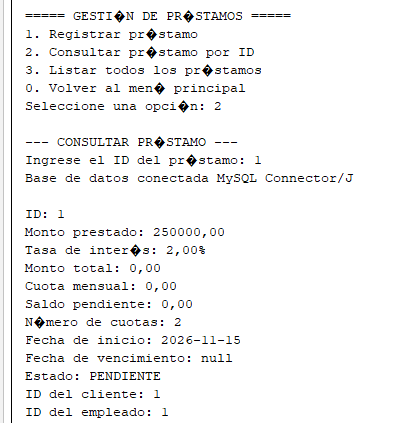
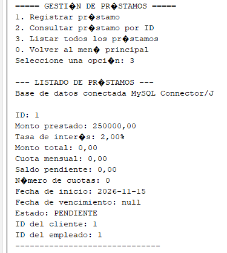
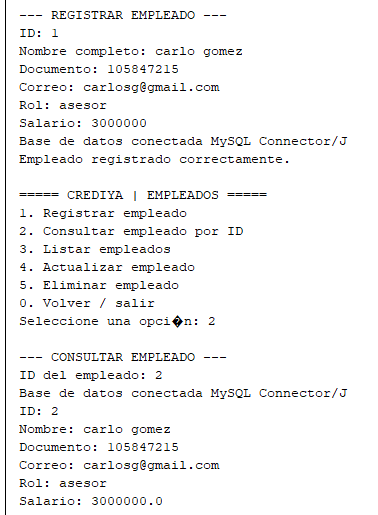
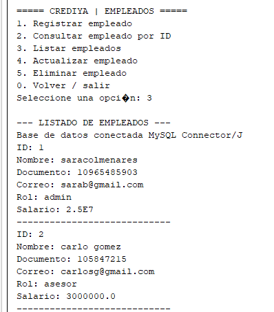

# Sistema de Cobros de Cartera "CrediYa"
---
## Sara Colemanares
---

## 1. Información General

Proyecto: Sistema de Gestión y Cobros de Cartera "CrediYa"

**Paradigma:** Programación Orientada a Objetos (POO) y Programación Funcional

**Tecnologías:** Java (JDK 17+ recomendado), MySQL (JDBC), Manejo de Archivos I/O, Consola Interactiva.

**Arquitectura:** Arquitectura en Capas (Modular, basada en separación de incumbencias y principios SOLID).
---
## 2. Descripción y Justificación del Problema

La empresa CrediYa S.A.S. operaba mediante un control manual y descentralizado basado en hojas de cálculo, lo que propiciaba inconsistencias en la información de préstamos, duplicidad de datos y una deficiente trazabilidad en el recaudo de cartera.

Para solventar esta problemática, se desarrolló un sistema robusto de consola en Java que automatiza y centraliza la gestión de empleados, clientes, créditos y pagos. El software garantiza la persistencia dual (memoria, archivos planos y base de datos relacional MySQL) e implementa rigurosos estándares de diseño de software e ingeniería de datos.

---
## 3. Arquitectura del Sistema y Organización de Paquetes

El proyecto se diseñó bajo una Arquitectura en Capas Estricta, aplicando el principio de responsabilidad única (Single Responsibility Principle de SOLID). El código fuente está estructurado modularmente en ocho paquetes lógicos, garantizando un bajo acoplamiento y una alta cohesión:

* conexion: Contiene las clases ConexionDB y Operaciones. Administra el ciclo de vida de la conexión a la base de datos MySQL mediante JDBC de forma centralizada y segura.

* modelo.clases: Agrupa el modelo de dominio y las entidades de negocio. Define la jerarquía de clases (Persona, Empleado, Cliente) y enumeraciones estables (EstadoPrestamo, MetodoPago, RolEmpleado).

* modelo.persistencia: Aloja las interfaces que fungen como contratos estructurales (Data Access Contracts), estandarizando las operaciones CRUD para las entidades principales (Cliente, Empleado, Pago, Prestamo).

* modelo.dao: Implementa la capa de acceso a datos (Data Access Object). Ejecuta las consultas y operaciones DML en MySQL utilizando sentencias preparadas (PreparedStatement) para mitigar ataques de inyección SQL e optimizar transacciones.

* service: Representa la capa de lógica de negocio y validaciones. Actúa como intermediario desacoplado entre el controlador y los DAOs. Incorpora reglas de negocio, manejo de excepciones personalizadas, filtrados avanzados mediante Stream API y expresiones Lambda.

* controlador: Intercepta y procesa las peticiones lógicas enviadas desde la capa de vista, invocando los servicios correspondientes y gestionando los flujos de ejecución.

* vista: Capa de presentación en consola. Proporciona menús interactivos amigables y estructurados para que el operador interactúe fluidamente con el sistema.

* Paquete de Soporte / Archivos: Gestiona la persistencia secundaria en archivos planos para respaldos o registros locales.

---
## 4. Aplicación de la Programación Orientada a Objetos (POO) y Principios SOLID
---
### 4.1. Herencia y Polimorfismo

Para evitar la redundancia de atributos y métodos comunes, se diseñó una jerarquía de clases fundamentada en la abstracción:

Clase Base (Persona): Encapsula los atributos de identificación comunes (id, nombre, documento, correo).

Clases Derivadas (Empleado y Cliente): Heredan de Persona mediante la palabra reservada extends, especializándose al incorporar sus propios atributos (por ejemplo, rol y salario para empleados; telefono y relación con préstamos para clientes).

Polimorfismo e Interfaces: Las interfaces ubicadas en modelo.persistencia establecen contratos formales que las clases de implementación deben cumplir obligatoriamente, permitiendo intercambiar implementaciones de persistencia sin alterar las capas superiores.

---
### 4.2. Principios SOLID

Principio de Responsabilidad Única (SRP): Cada paquete y clase cumple un rol específico; por ejemplo, la capa service maneja exclusivamente la lógica de validación y transformación de datos, separándose por completo de las operaciones de base de datos (modelo.dao) y de la interacción con el usuario (vista).

Abstracción y Encapsulamiento: Los atributos de las entidades son privados (private) y se accede a ellos a través de métodos de acceso seguros (getters y setters), resguardando la integridad del estado interno de los objetos.

---
### 5. Procesamiento Avanzado de Datos (Stream API y Expresiones Lambda)

En el paquete service, se incorporaron características modernas de Java para la consulta eficiente de grandes volúmenes de datos en colecciones. Se implementó la Stream API junto con expresiones Lambda para resolver requerimientos analíticos complejos sin comprometer el rendimiento, tales como:

Filtrado en tiempo de ejecución de préstamos activos y vencidos.

Identificación automatizada de clientes morosos bajo criterios de saldo pendiente y fechas de corte.

Agrupación y mapeo de transacciones financieras para la generación de reportes gerenciales directos en la consola.

---
### 6. Persistencia de Datos (MySQL JDBC y Archivos)

El sistema garantiza la persistencia híbrida mediante dos mecanismos complementarios:

Base de Datos Relacional (MySQL): Conexión robusta mediante JDBC utilizando PreparedStatement para garantizar la parametrización de consultas y salvaguardar la integridad transaccional del sistema durante el registro de pagos, abonos y actualización de saldos pendientes en los préstamos.

Archivos Planos: Mecanismo de respaldo secundario para auditorías rápidas y persistencia ligera de registros institucionales.

---

### 7. Instrucciones de Compilación y Ejecución

Para compilar y ejecutar el proyecto desde la línea de comandos o un entorno de desarrollo integrado (IDE como IntelliJ IDEA o Eclipse):

Configuración de Base de Datos:

Crear una base de datos en MySQL con el nombre correspondiente al esquema del proyecto.

Verificar las credenciales de acceso (puerto, usuario y contraseña) en la clase de conexión (ConexionDB).

**Compilación:**

javac -d bin $(find src -name "*.java")

**Ejecución:**

java -cp bin controlador.Principal

---
## 8. Diagrama UML

---
## 9. Capturas de evidencia

**prestamos**

**Empleado**

